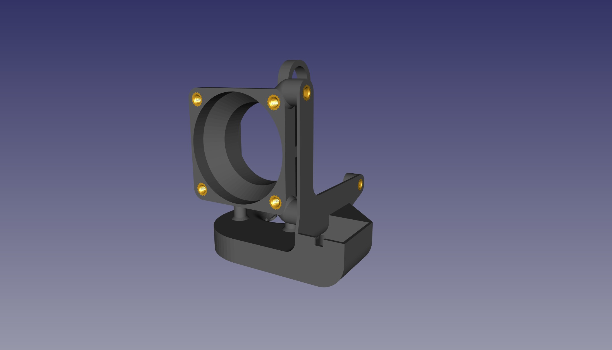
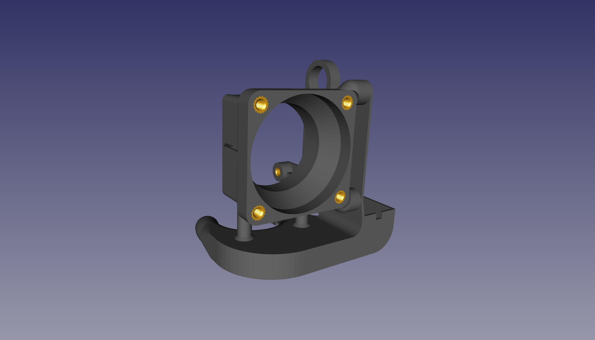
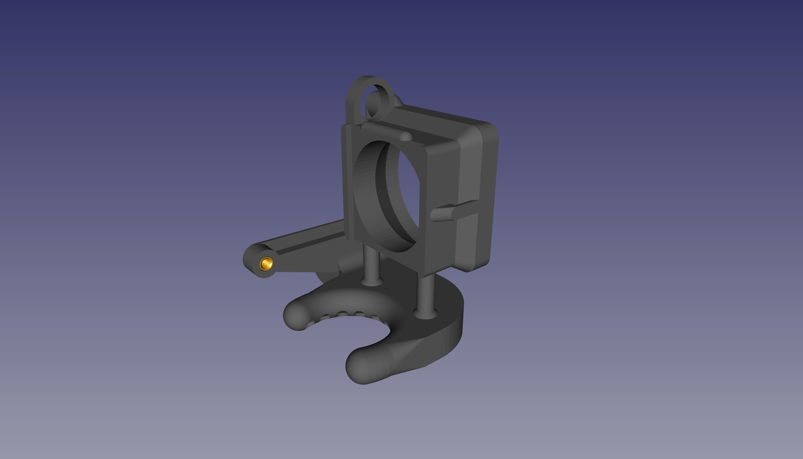
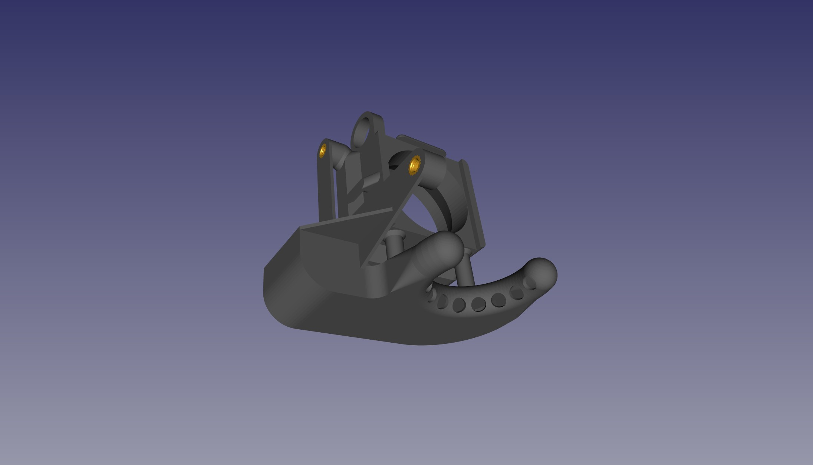
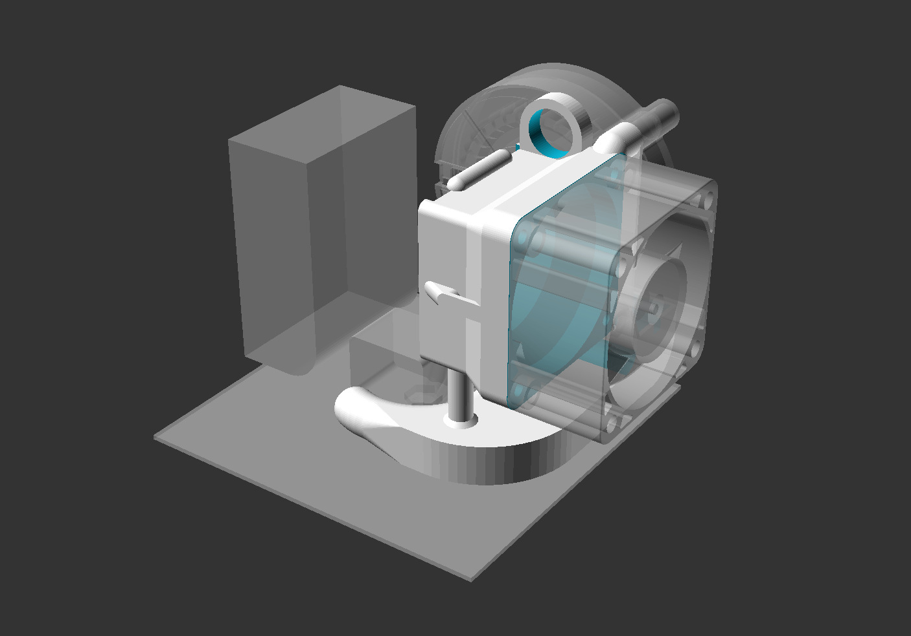
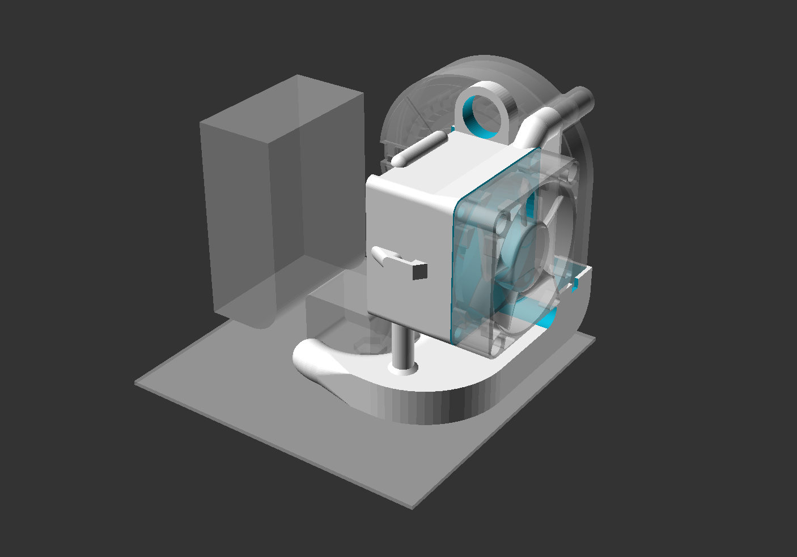
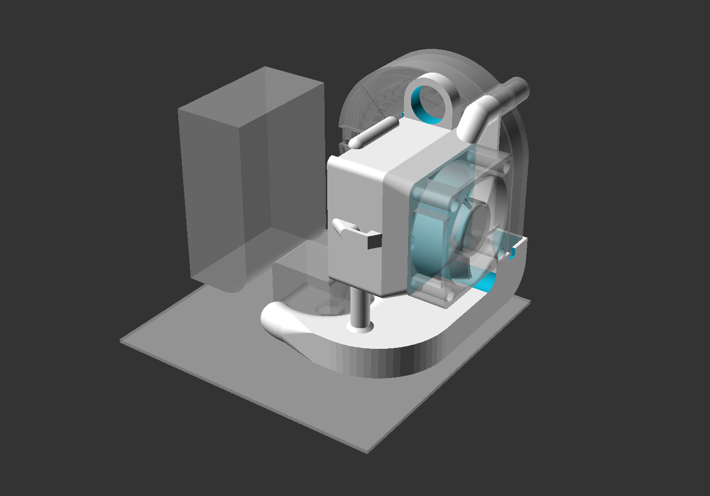
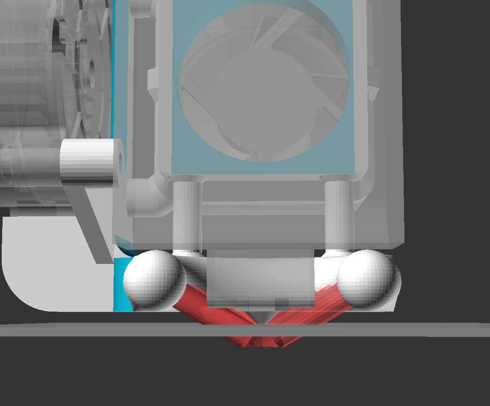
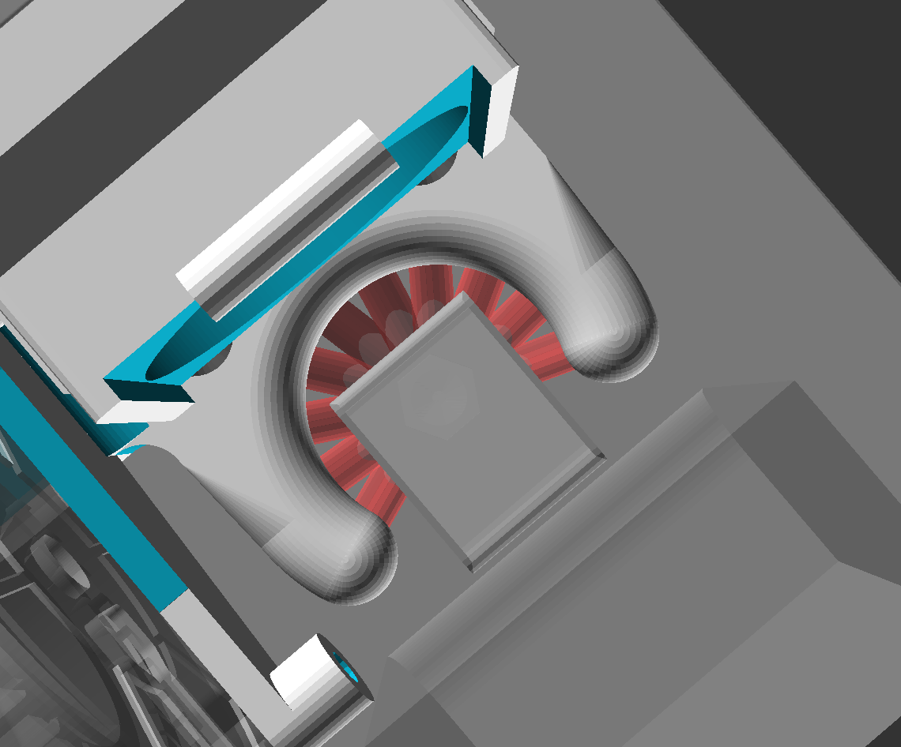

# MPSM_duct_BKW

Hotend fan and part cooling blower duct for Monoprice Select Mini 3d printer.

The source is in OpenSCAD. The FreeCAD file is only used to make the pretty renders.  
The model is highly parametric and uses the openscad customizer to adjust all kinds of things.  

The major options are:  
* Fan size: 40mm, 35mm, 30mm
* Screw holes sized for screwing directly into the plastic, or pockets for heat-set inserts

Other options:
* Stock vs [CHC](https://trianglelab.net/products/chcceramic-heating-core-kit?VariantsId=10256) heater cartridge
* Degrees of wrap around the nozzle.

With a CHC heater, the blower output manifold can go all the way around the nozzle in a donut, amd the duct & manifold tube can be a little bigger.

40mm fan  
You don't need a 40x20 like this. A silent Noctua 40x10 would be plenty considering the original fan is only 30x10 and did both the heat-break and the part cooling.  
By itself a larger fan like this doesn't do as much good as it could, because the stock carriage doesn't provide very much air flow behind the heat-sink. It's intentionally slightly restrictive to force some of the air to go down to the stock part cooling duct. It's possible to drill 4 more holes in the carriage between the heat-sink and the rails without even taking the printer apart. 8mm or 5/16" drill, one vertical in the center right in front of the rails, through the top & bottom, and one horizontal between the rails. Adds 4 more 8-9mm holes for hot-end fan air to exhaust.  

35mm fan  
35mm is a less common size but they do exist and the hot-end duct on the printer happens to be 35mm so it looks visually neat.  

30mm fan  
This doesn't look the best, but the usefulness is the original fan is 30mm, so with this version you can re-use the original fan.  
It's still an improvement over stock because now it's dedicated 100% to the heat-break, and remember a standard E3D V6 only has a 30mm fan, so this should actually be fine.  

