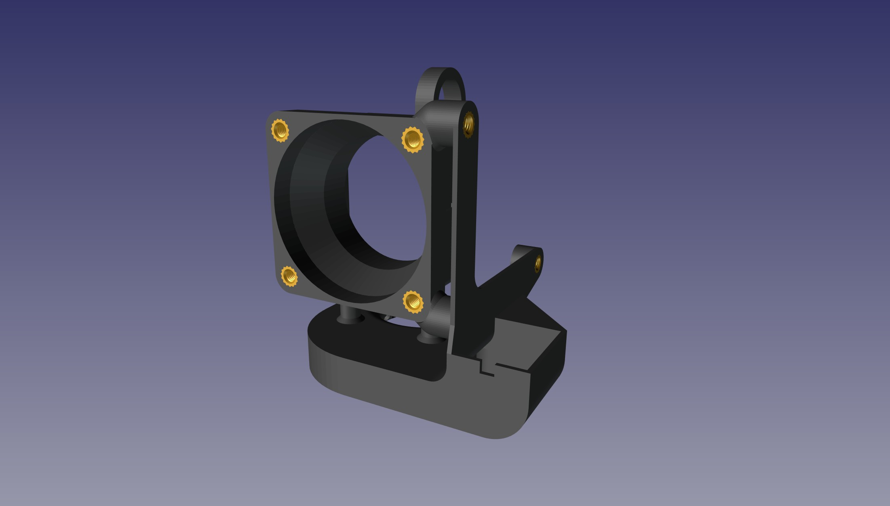
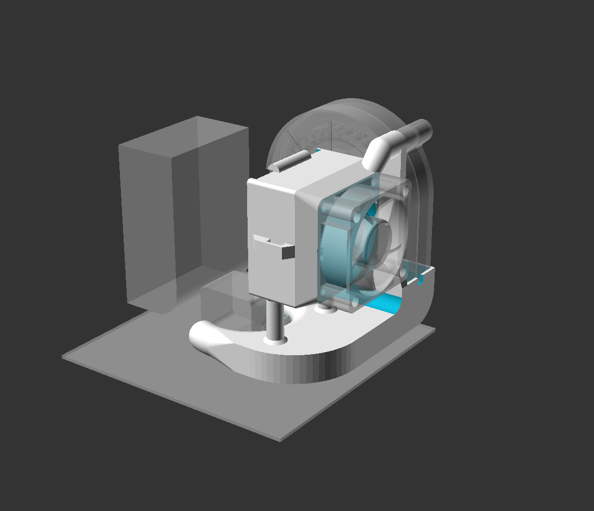
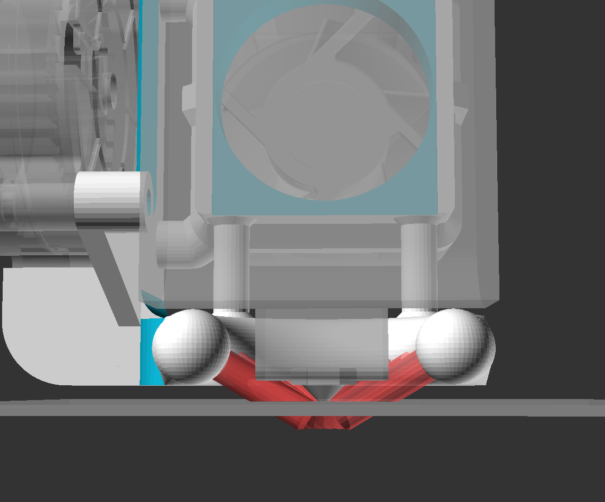
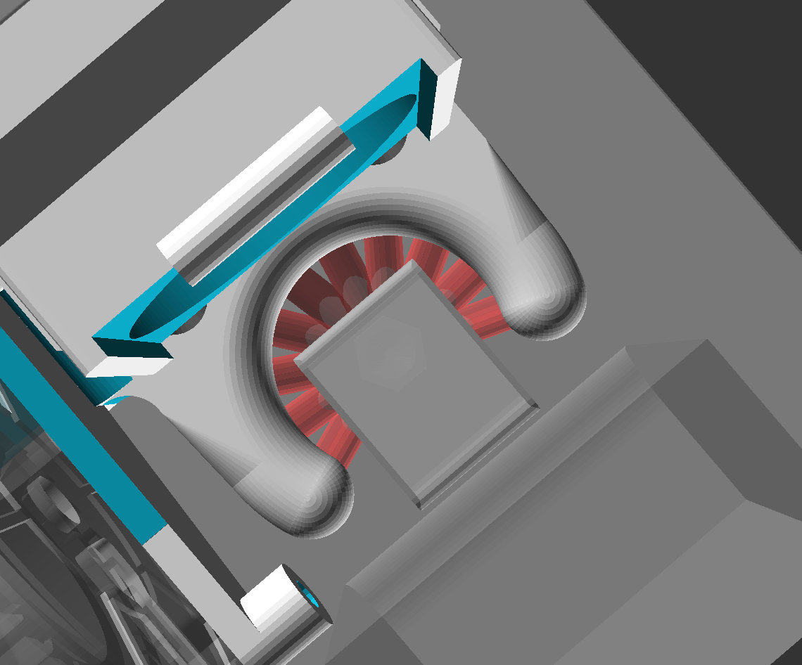

# MPSM_duct_BKW

Hotend fan and part cooling blower duct for Monoprice Select Mini 3d printer.

The model is highly parametric and uses the openscad customizer to adjust all kinds of things.  
Thre major options are:  
* fan size: 40mm, 35mm, 30mm
* screw holes sized for screwing directly into the plastic, or pockets for heat-set inserts

40mm fan  
You don't need a 40x20 like this. A silent noctua 40x10 would be plenty considering the original fan is only 30x10 and did both the heat break and the part cooling.  
I have retrofitted my hotend with a standard E3D V6 style heat sink, bimetal heat break, and Triangle Lab CHC ceramic heater cartridge, so it can run hotter than stock. So I wanted the extra hotend cooling to prevent heat creep.  
I drilled 4 more holes in the hotend carriage behind the heat sink to allow more air flow.  
(8 or 9mm, 1 vertical through top & bottom right between the bearings close to the rails, and one horizontal, adding 4 total 8-9mm holes behind the hotend).  

35mm fan  
35mm is a less common size but they do exist and the hot-end duct on the printer happens to be 35mm wide by 34mm tall.  

30mm fan  
The original fan is 30mm, so with this version you can just re-use the original fan, only this way it's dedicated 100% for the heat break.  
Aslo a standard E3D V6 only has a 30mm fan and they are perfectly effective.  

